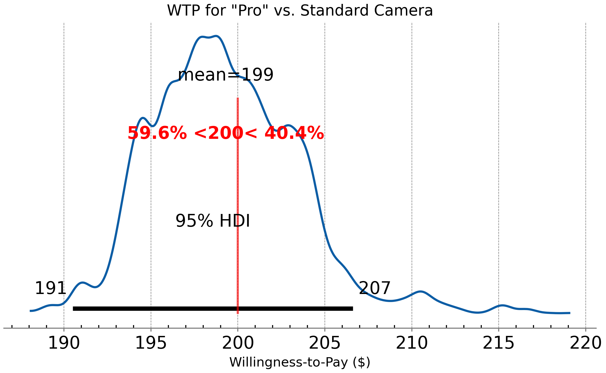
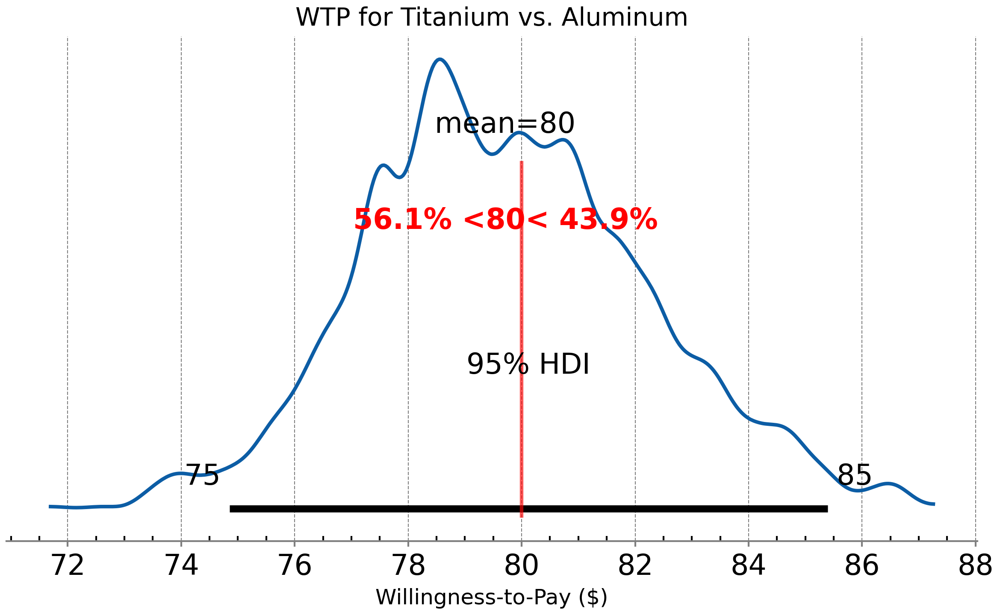
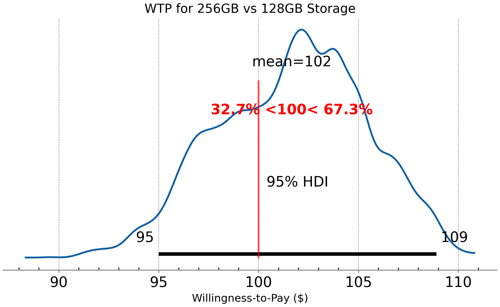
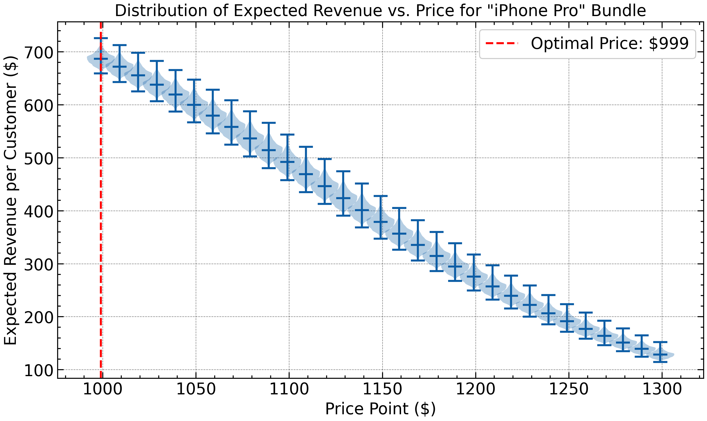

# What is in a Price? Estimating Willingness-to-Pay with Bayesian Hierarchical Models

[](https://opensource.org/licenses/MIT)

This repository contains the official code and figures for the paper accepted at the **2025 Advances in Science and Engineering Technology International Conferences (ASET)**.

**Authors:** Srijesh Pillai, Rajesh Kumar Chandrawat  
**Paper Link:** https://arxiv.org/abs/2509.11089

---

## Abstract
> For premium consumer products, pricing strategy is not about a single number, but about understanding the perceived monetary value of the features that justify a higher cost.
> This paper proposes a robust methodology to deconstruct a product's price into the tangible value of its constituent parts.
> We employ Bayesian Hierarchical Conjoint Analysis, a sophisticated statistical technique, to solve this high-stakes business problem using the Apple iPhone as a universally recognizable case study.
> Our results demonstrate that the model successfully recovers the true, underlying feature valuations from noisy data, providing not just a point estimate but a full posterior probability distribution for the dollar value of each feature.
> This work provides a powerful, practical framework for data-driven product design and pricing strategy, enabling businesses to make more intelligent decisions about which features to build and how to price them.

---

## Key Results: Recovering Feature Valuations

> The core contribution of this work is the ability to recover the dollar-value Willingness-to-Pay (WTP) for product features from simulated consumer choice data. 
> The model successfully recovers the ground truth values (red lines) for all features.

| Pro Camera ($200) | Titanium Frame ($80) | 256GB Storage ($100) |
| :---: | :---: | :---: |
|  |  |  |

## Business Application: Revenue Optimization

> Beyond valuation, the posterior distributions from the model can be used to directly inform business strategy.
> We simulated an optimal pricing policy for a new "iPhone Pro" bundle (Pro Camera + Titanium Frame).
> The analysis reveals a clear revenue-maximizing price point at **$999**.



---

## Reproducibility

This entire analysis is fully reproducible. The script `run_analysis.py` performs the entire pipeline from data simulation to model fitting and figure generation.

### 1. Setup

First, clone this repository and navigate into the directory:
```bash
git clone https://github.com/YOUR_USERNAME/bayesian-willingness-to-pay.git
cd bayesian-willingness-to-pay
```

Next, create a Python virtual environment and install the required dependencies:
```bash
# Create a virtual environment (optional but recommended)
python -m venv venv
source venv/bin/activate  # On Windows, use `venv\Scripts\activate`

# Install dependencies
pip install -r requirements.txt
```

### 2. Running the Analysis

To run the complete end-to-end analysis, simply execute the main script:
```bash
git clone https://github.com/YOUR_USERNAME/bayesian-willingness-to-pay.git
cd bayesian-willingness-to-pay
```

Next, create a Python virtual environment and install the required dependencies:
```bash
python run_analysis.py
```

The script will perform the following steps:
1. Define the ground truth WTP values.
2. Simulate a choice-based conjoint survey with 300 respondents.
3. Prepare the data and build the Bayesian Hierarchical Logit Model using PyMC.
4. Fit the model using MCMC sampling.
5. Analyze the results, un-scale the coefficients to calculate WTP, and save the posterior plots to the outputs/ directory.
6. Run the revenue optimization simulation and save the final plot.
